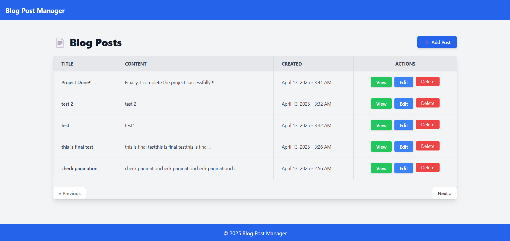

<h1>📄 Blog Post Manager</h1>

A lightweight blog post manager built with <strong>Laravel 11</strong> and <strong>Tailwind CSS</strong>. It allows users to create, read, update, and delete posts with pagination and a modern UI.

<h2>🚀 Setup Instructions</h2>

<ol>
  <li><strong>Clone the Repository:</strong>
    <pre><code>git clone https://github.com/YOUR-USERNAME/blog-post-manager.git
cd blog-post-manager</code></pre>
  </li>
  <li><strong>Install PHP Dependencies:</strong>
    <pre><code>composer install</code></pre>
  </li>
  <li><strong>Install Node.js Dependencies:</strong>
    <pre><code>npm install
npm run dev</code></pre>
  </li>
  <li><strong>Configure Environment:</strong>
    <pre><code>cp .env.example .env
php artisan key:generate</code></pre>
  </li>
  <li><strong>Set up the Database:</strong>
    <pre><code>php artisan migrate --seed</code></pre>
  </li>
  <li><strong>Start the Development Server:</strong>
    <pre><code>php artisan serve</code></pre>
  </li>
</ol>

<h2>🖼️ UI Screenshots</h2>

<strong>Dashboard</strong>

  

<strong>Create New Post</strong>

 

<strong>view single post</strong>

 

<strong>edit post</strong>

 

<strong>flash message after create new post</strong>

 

<strong>delete confirmation</strong>

 

<strong>post delete flash message</strong>

 

<strong>pagination 1 page max 5 posts</strong>

 

<h2>📌 Features</h2>

<ul>
  <li>Laravel 11 with Eloquent ORM</li>
  <li>Tailwind CSS UI</li>
  <li>CRUD (Create, Read, Update, Delete)</li>
  <li>Pagination with page-aware delete</li>
  <li>Flash messages & error handling</li>
  <li>Clean Git-based project structure</li>
</ul>

<h2>📂 Folder Structure</h2>

<ul>
  <li><code>/resources/views</code> – Blade templates</li>
  <li><code>/routes/web.php</code> – Route definitions</li>
  <li><code>/app/Http/Controllers/PostController.php</code> – Logic controller</li>
</ul>

<h2>📌 Evaluation Criteria</h2>

<ul>
  <li>✅ Proper use of Laravel 11 features</li>
  <li>✅ Tailwind layout and styling</li>
  <li>✅ Clean, maintainable code</li>
  <li>✅ Basic validation and error handling</li>
  <li>✅ Git project structure</li>
</ul>

<h2>📫 Contact</h2>

Developed by <strong>Supun Abayarathna </strong> 

